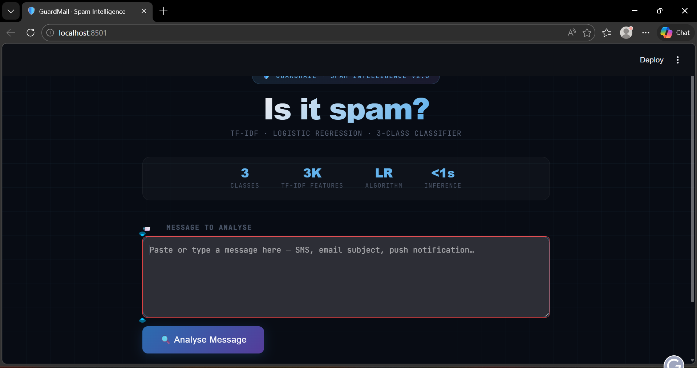
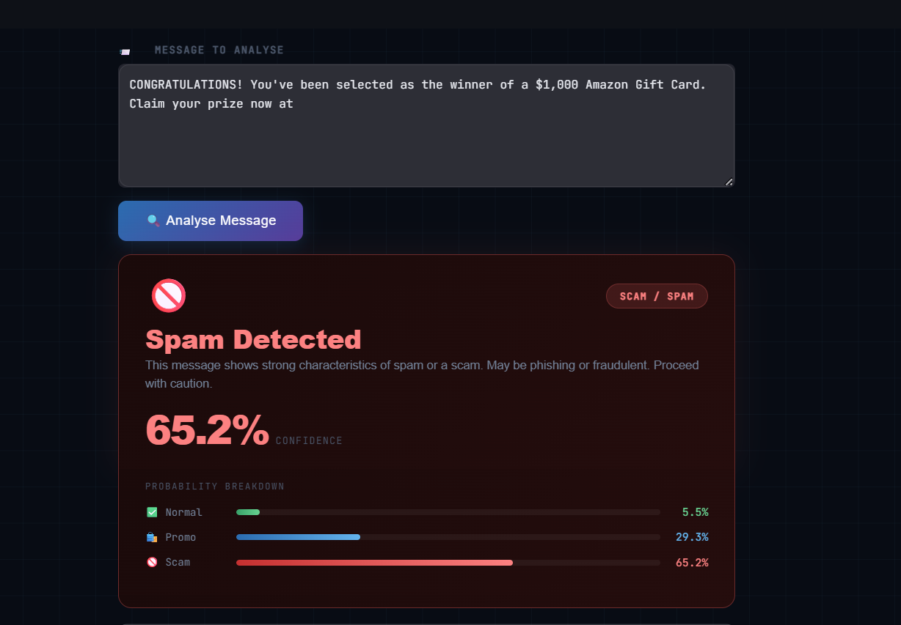
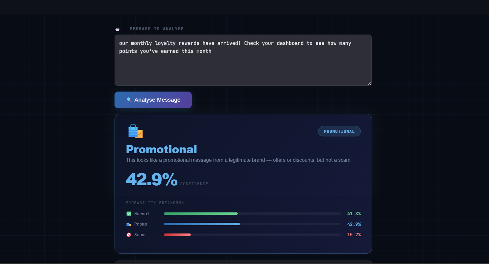
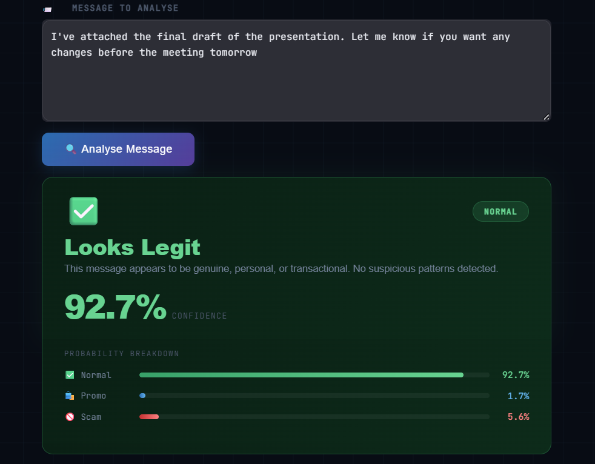

# Spam-Detection
# 📧 Smart Spam Detection System (Multi-Class NLP)

An end-to-end Machine Learning project that intelligently classifies text messages into:

* ✅ **Normal Messages**
* 🛍️ **Promotional Messages**
* 🚫 **Scam/Spam Messages**

This project goes beyond basic spam detection by distinguishing **legitimate promotional content from harmful spam**, making it closer to real-world systems like email filters.

---

## 🚀 Features

* 🧹 Advanced text preprocessing (NLTK + regex)
* 🔤 TF-IDF vectorization for feature extraction
* 🧠 Multi-class classification (Normal / Promotional / Spam)
* ⚖️ Handles class imbalance using `class_weight='balanced'`
* 📊 Model comparison (Naive Bayes vs Logistic Regression)
* 🌐 Interactive **Streamlit UI**
* 📈 Confidence score & prediction probabilities
* 🔍 Shows cleaned text for transparency

---
## 📸 App Preview

### 🏠 Home Screen


### 🚫 Spam Detection


### 🛍️ Promotional Detection


### ✅ Normal Message


## 🧠 Tech Stack

* **Python**
* **Scikit-learn**
* **NLTK**
* **Pandas**
* **Streamlit**

---

## 📊 Model Performance

* Logistic Regression used as final model
* High overall accuracy (~98%)
* Improved detection of:

  * Promotional vs Spam messages
  * Real-world ambiguous cases

---

## 📁 Project Structure

spam-detection-ml/
│
├── model.py                 # End-to-end ML pipeline (data loading, preprocessing, training, evaluation)
├── app.py                   # Streamlit UI for real-time predictions
│
├── spam_classifier.pkl      # Trained multi-class classification model
├── tfidf_vectorizer.pkl     # TF-IDF vectorizer used for feature extraction
│
├── requirements.txt         # Project dependencies
├── README.md                # Project documentation
│
├── data/
│   ├── spam.csv             # Base dataset (ham + spam)
│   ├── spam_texts.csv       # Additional labeled dataset (promotional + spam)
│
├── assets/                  # Screenshots for README
│   ├── ui-home.png
│   ├── spam-result.png
│   ├── promotional-result.png
│   └── normal-result.png

---

## ▶️ How to Run

### 1. Install dependencies

```bash
pip install -r requirements.txt
```

### 2. Run the app

```bash
streamlit run app.py
```

---

## 💡 Example Predictions

| Message                       | Prediction      |
| ----------------------------- | --------------- |
| "Win ₹5000 now!!! Click here" | 🚫 Spam         |
| "Flat 50% off on Myntra Sale" | 🛍️ Promotional |
| "Call me when you're free"    | ✅ Normal        |

---

## 🧠 Key Learning Outcomes

* Built a **complete ML pipeline** from scratch
* Implemented **multi-class classification**
* Handled **real-world ambiguity in text data**
* Learned importance of:

  * Data quality over model complexity
  * Feature engineering (TF-IDF)
* Developed a **deployable ML application**

---

## 🔥 Unique Aspect

Unlike basic spam classifiers, this project:

✔️ Differentiates **promotions vs scams**
✔️ Uses curated real-world datasets
✔️ Focuses on **practical usability**

---

## 📌 Future Improvements

* 🤖 Use deep learning models (LSTM, BERT)
* 📚 Expand dataset for better generalization
* 🌐 Deploy on cloud (Streamlit Cloud / AWS)
* 🎨 Enhance UI with advanced design (glassmorphism)

---

## 👩‍💻 Author

**Ayesha**

---

## ⭐ If you like this project

Give it a ⭐ on GitHub and share feedback!
